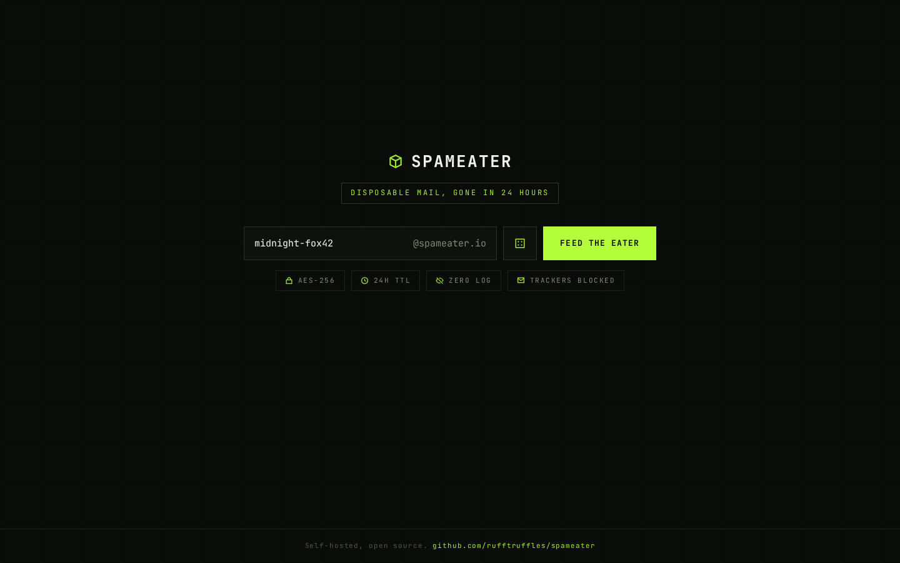
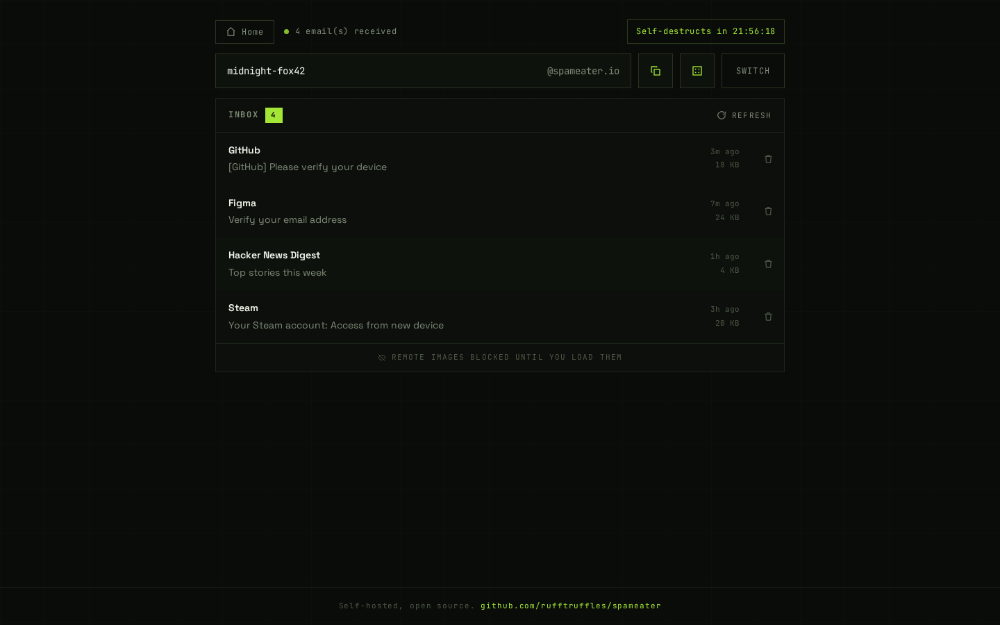
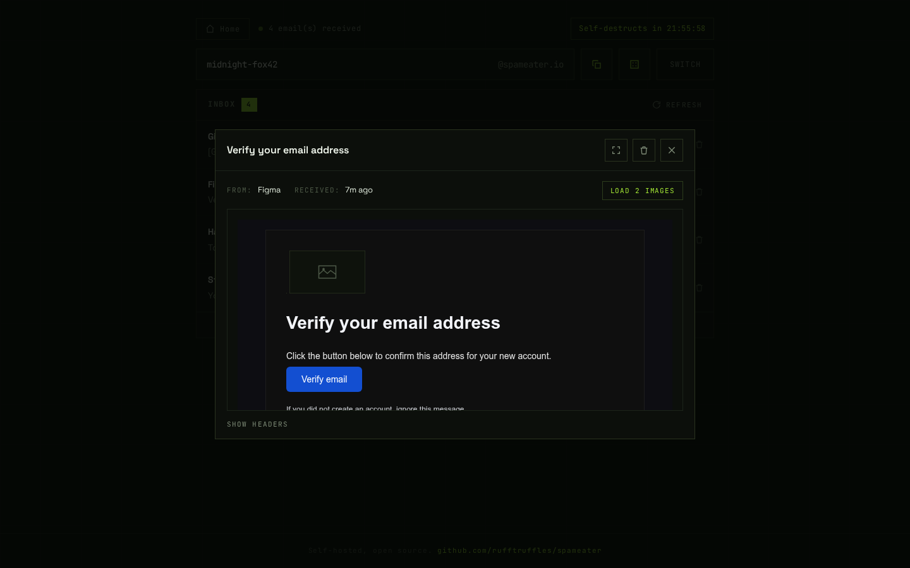

# SpamEater


[](https://opensource.org/licenses/MIT)
[](docker/)


**Self-hosted disposable email. Every inbox deletes itself after 24 hours.**

SpamEater runs on your own domain and server. Type a name, get an inbox, use it for signups and testing, and let it burn. No accounts, no tracking, no recovery. Email bodies are encrypted at rest with AES-256-GCM.

## What's new in v4

**Email rendering, rebuilt.**
- HTML mail is adapted to the dark interface color by color: the sender's layout, tables, and buttons stay intact instead of being flattened by forced styles. Mail designed dark passes through untouched. A contrast guard checks the rendered result and lifts any text a sender left unreadable, whatever markup produced it.
- Forwarded mail displays now. The MIME tree is walked in full, so text nested under `multipart/mixed` (every forward, every attachment-bearing message) is found instead of coming up "No content available".
- Inline images (signature logos referenced by `cid:`) are embedded at ingestion and render like the sender intended. Remote images stay blocked until you load them for that email — tracking pixels never fire on open.
- Links open in a new tab with `noopener` and no referrer. Dark scrollbars, readable dividers, correct rendering at phone widths.

**Terminal Ledger interface.** New design across every screen, self-hosted fonts, SVG iconography, themed install scripts to match. The browser loads nothing from third-party CDNs. Copy button, random address generator, live self-destruct countdown, styled delete confirmation.

**Operations and security.**
- Docker upgrades keep your data: secrets persist on the data volume, so `docker compose pull && up -d` no longer regenerates the encryption key that protects stored mail.
- Email `<style>` blocks survive ingestion (they were stripped since v1, which is why styled mail looked broken).
- The 24-hour countdown starts at inbox creation and cannot silently restart on first delivery.
- Fixed a crash on malformed delete tokens; fresh installs work on both Haraka 3.1 and 3.3 APIs.
- `package.json` with pinned versions and a committed lockfile; CI installs, audits, and tests before publishing an image. First test suite in the repo.

## Screenshots

<div align="center">
  
  <br>
  <em>Pick a name or roll the dice</em>
  <br><br>
  
  <br>
  <em>Inbox with live countdown, copy, and switch controls</em>
  <br><br>
  
  <br>
  <em>HTML mail adapted to dark, remote images blocked until loaded</em>
</div>

## Features

**Privacy**
- No user accounts, tracking, or analytics
- Inboxes and mail deleted after 24 hours, no recovery
- Email bodies encrypted at rest (AES-256-GCM)
- Remote images blocked by default; tracking pixels never fire on open
- The web app serves everything from your own host

**Security**
- ModSecurity WAF with the OWASP Core Rule Set
- fail2ban intrusion prevention
- CSRF tokens plus HMAC delete tokens
- Rate limiting per IP and per inbox at the SMTP, WAF, and API layers
- HTTPS via Let's Encrypt with automatic renewal; security headers (CSP, HSTS, X-Frame-Options)

**Technical**
- Haraka SMTP server, Express API, SQLite storage
- Vanilla JavaScript frontend, no build step
- Inbox updates by polling every 3 seconds
- Docker image and native installer

## Quick start

### Prerequisites

1. **A domain you own** (e.g. `example.com`)

2. **DNS records, configured before installation:**

   For private/personal use (recommended, better isolation):
   ```
   MX  example.com       10 mail.example.com
   A   mail.example.com  YOUR_SERVER_IP
   A   app.example.com   YOUR_SERVER_IP    (web interface)
   ```

   For public use (simpler):
   ```
   MX  example.com       10 mail.example.com
   A   mail.example.com  YOUR_SERVER_IP
   A   example.com       YOUR_SERVER_IP    (web + email on same domain)
   ```

3. **Verify DNS before proceeding** (propagation can take up to 48 hours; certificate issuance fails without it):
   ```bash
   dig MX example.com
   dig A mail.example.com
   ```

4. **Server**: static public IP, ports 25, 80, and 443 open.

---

<details>
<summary><b>Docker deployment (recommended)</b></summary>

### Requirements
- Docker Engine 20.10+ and Docker Compose v2+
- Any modern Linux distribution

### Installation

```bash
# Download configuration
wget https://raw.githubusercontent.com/rufftruffles/spameater/main/docker-compose.yml

# Edit your domains (hostname, EMAIL_DOMAIN, WEB_DOMAIN)
nano docker-compose.yml

# Deploy
docker compose up -d
```

Secrets are generated on first start and stored on the data volume, so later upgrades and recreates keep the same encryption key. SSL certificates come from Let's Encrypt automatically.

**Access:** `https://app.example.com` (your WEB_DOMAIN)

### Management

```bash
docker compose logs -f                              # logs
docker compose restart                              # restart services
docker compose pull && docker compose up -d         # upgrade
docker exec -it spameater supervisorctl status      # service status

# Backup (data volume holds the database, inbox cache, and secrets)
docker run --rm -v spameater_data:/data -v $(pwd):/backup alpine tar czf /backup/spameater-backup-$(date +%Y%m%d).tar.gz -C /data .
```

Upgrading from v3: if the old container is still running, restart in place once (`docker compose restart`) before recreating, and the existing key is migrated to the volume. If the container was already recreated, the old key is gone with it — with the 24-hour retention window that costs at most one day of mail.

</details>

---

<details>
<summary><b>Native installation (advanced)</b></summary>

### Supported systems
- AlmaLinux 9 / RHEL 9 / Rocky Linux 9
- Ubuntu 22.04+ / Debian 11+

### Installation

```bash
git clone https://github.com/rufftruffles/spameater.git
cd spameater
sudo ./setup.sh
```

The script installs Node.js, Haraka, nginx with ModSecurity, fail2ban, and the SQLite database, sets up systemd services, and obtains certificates.

### Management

```bash
systemctl status haraka spameater-api nginx
journalctl -u haraka -f
journalctl -u spameater-api -f
tail -f /opt/spameater/logs/haraka.log
```

Configuration lives in `/opt/spameater/.env` (`EMAIL_DOMAIN`, `WEB_DOMAIN`, secrets). Restart services after editing.

### Uninstall

```bash
sudo ./uninstall.sh
```

Removes all services, data, and configuration.

</details>

---

## Architecture

```
Internet → Nginx (SSL/WAF) → Express API (:3001) → SQLite
    ↓                                ↓
Haraka SMTP (:25) ─────────────→ SQLite + JSON inbox cache
```

- **Haraka** receives mail, encrypts bodies, writes the database and the per-inbox JSON cache
- **Nginx** terminates TLS, runs ModSecurity, serves the frontend and inbox JSON
- **Express** handles inbox creation and authenticated deletion
- **Cleanup cron** enforces the 24-hour TTL and storage quotas hourly

## Development

```bash
npm ci
npm test                                        # node:test suite

# Local dev stack (no root, no /opt) — http://127.0.0.1:8080
mkdir -p .devhome/data/inboxes
sqlite3 .devhome/data/emails.db < database/schema.sql
SPAMEATER_HOME=$PWD/.devhome node scripts/seed-inbox.js
SPAMEATER_HOME=$PWD/.devhome DELETE_TOKEN_SECRET=$(openssl rand -hex 16) CSRF_SECRET=$(openssl rand -hex 16) ENCRYPTION_KEY=$(openssl rand -hex 16) node api-server.js &
SPAMEATER_HOME=$PWD/.devhome node scripts/dev.js
```

### Test email reception

```bash
telnet your-domain.com 25
HELO test
MAIL FROM: <test@example.org>
RCPT TO: <anything@your-domain.com>
DATA
Subject: Test
Test message.
.
QUIT
```

## Security notes

- Delete operations require a CSRF token and a rotating HMAC delete token, compared in constant time.
- Anyone who knows an inbox name can read that inbox; that is the design of an accountless service. Use random names (the dice button) for anything you would rather keep to yourself.
- Inbound SMTP on port 25 is plaintext, as is most server-to-server mail today. The web interface is HTTPS-only.
- Report vulnerabilities through the GitHub Security tab.

## License

MIT — see [LICENSE](LICENSE). Copyright (c) 2025 rufftruffles

## Acknowledgments

- [Haraka](https://haraka.github.io/) SMTP framework
- [OWASP CRS](https://coreruleset.org/) WAF rules
- [DOMPurify](https://github.com/cure53/DOMPurify) HTML sanitizer
- [Let's Encrypt](https://letsencrypt.org/) certificates

## Disclaimer

SpamEater is for throwaway mail. Everything is deleted after 24 hours with no recovery. Do not point anything important at it.
