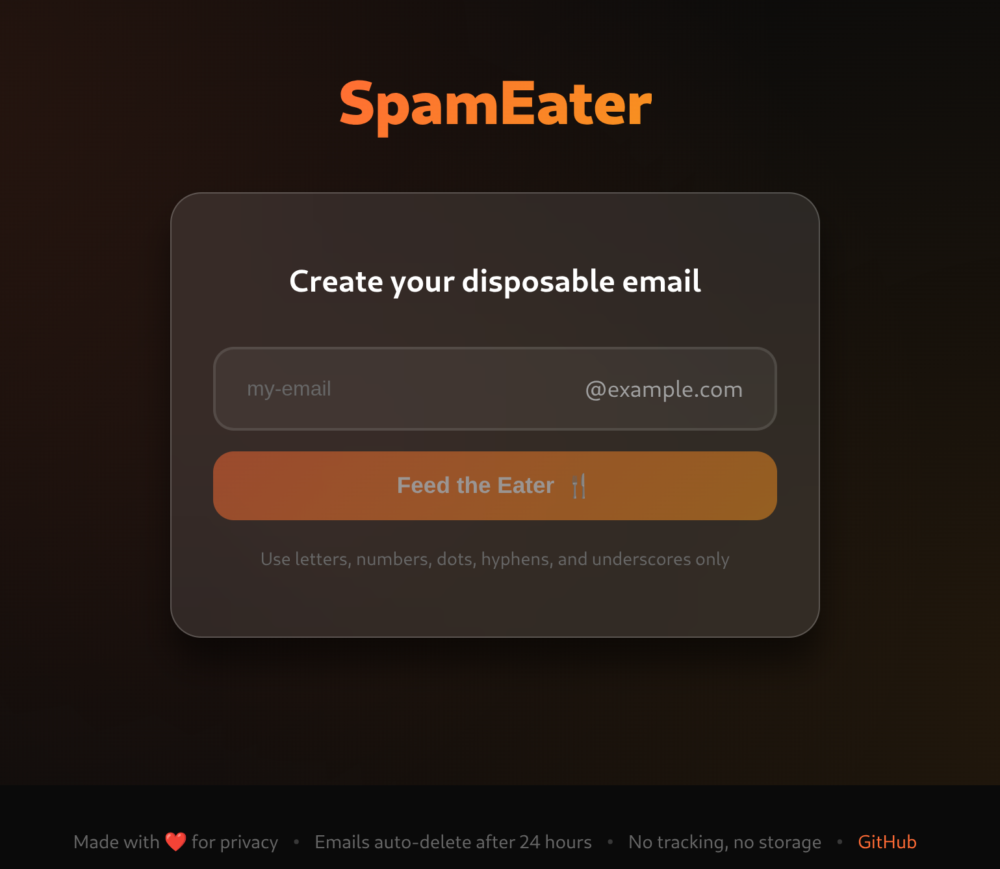

# SpamEater


[](https://opensource.org/licenses/MIT)
[](docker/)
[](deploy/)


**Privacy-focused disposable email service with automatic 24-hour deletion.**

SpamEater is a self-hosted, open-source disposable email server that prioritizes privacy and security. Perfect for testing, sign-ups, and protecting your real email from spam. All emails are automatically deleted after 24 hours with no recovery option.

## Screenshots

<details>
<summary><b>Click to view screenshots</b></summary>
<br>
<div align="center">
  
  <br>
  <em>Create disposable email addresses instantly</em>
  <br><br>
  
  <br>
  <em>Real-time email reception with clean interface</em>
</div>
</details>

## Features

**Privacy First**
- No tracking, analytics, or external dependencies
- No user registration required
- All emails auto-deleted after 24 hours
- Email body encryption at rest (AES-256-GCM)
- No content logging

**Security**
- ModSecurity WAF with OWASP Core Rule Set
- fail2ban intrusion prevention
- CSRF and XSS protection
- Rate limiting per IP and per inbox
- SQL injection prevention
- Automatic SSL with Let's Encrypt
- Security headers (CSP, HSTS, X-Frame-Options)

**Technical**
- High-performance Haraka SMTP server
- Lightweight SQLite database
- Vanilla JavaScript frontend (no frameworks)
- Real-time email updates via polling
- RESTful API
- Docker support with prebuilt images

## Quick Start

### Prerequisites

1. **Domain Name** - You must own a domain (e.g., `example.com`)

2. **DNS Configuration** - Configure these records BEFORE installation:
   
   **For private/personal use (recommended - better security):**
   ```
   MX  example.com       10 mail.example.com
   A   mail.example.com  YOUR_SERVER_IP
   A   app.example.com   YOUR_SERVER_IP    (web interface)
   ```
   Using a subdomain like `app.example.com` for the web interface provides better security isolation when running a private instance for personal use.
   
   **For public use (simpler, but less secure):**
   ```
   MX  example.com       10 mail.example.com
   A   mail.example.com  YOUR_SERVER_IP
   A   example.com       YOUR_SERVER_IP    (web + email on same domain)
   ```
   Using the root domain `example.com` for the web interface is simpler for public instances, but provides less security isolation.

3. **Verify DNS** is working before proceeding:
   ```bash
   dig MX example.com
   dig A mail.example.com
   ```
   DNS propagation can take up to 48 hours. SSL certificate generation will fail without proper DNS.

4. **Server Requirements**:
   - Ports 25, 80, 443 open and accessible
   - Static public IP address

---

<details>
<summary><b>Docker Deployment (Recommended)</b></summary>

### Requirements
- Docker Engine 20.10+
- Docker Compose v2+
- Any modern Linux distribution (AlmaLinux, Ubuntu, Debian, etc.)

### Installation

```bash
# Download configuration
wget https://raw.githubusercontent.com/rufftruffles/spameater/main/docker-compose.yml

# Edit your domain (lines 18 and 45)
nano docker-compose.yml

# Deploy
docker compose up -d
```

**Important Security Recommendation:** For private/personal use, use a subdomain for the web interface (e.g., `app.example.com`) for better security isolation between the email service and web application. For public instances open to everyone, you can use the root domain (`example.com`) for simplicity, though it provides less security isolation.

Edit these lines in `docker-compose.yml`:
```yaml
hostname: example.com                    # Email domain
environment:
  EMAIL_DOMAIN: example.com              # Emails received at *@example.com
  WEB_DOMAIN: app.example.com            # Web interface at https://app.example.com
```

**Access:** Web interface at `https://app.example.com` (or your WEB_DOMAIN)

All security secrets are auto-generated on first run. SSL certificates are obtained automatically from Let's Encrypt.

### Management

```bash
# View logs
docker compose logs -f

# Restart services
docker compose restart

# Stop services
docker compose down

# Update to latest version
docker compose pull
docker compose up -d

# Check service status
docker compose ps
docker exec -it spameater supervisorctl status

# Backup data
docker run --rm -v spameater_data:/data -v $(pwd):/backup alpine \
  tar czf /backup/spameater-backup-$(date +%Y%m%d).tar.gz -C /data .
```

### Troubleshooting

**Container Won't Start**
```bash
docker compose logs spameater
docker compose config
netstat -tulpn | grep -E ':(25|80|443)'
```

**Emails Not Receiving**
```bash
# Verify DNS
dig MX your-domain.com
dig A mail.your-domain.com

# Check SMTP service
docker exec -it spameater supervisorctl status haraka
docker exec -it spameater tail -f /opt/spameater/logs/haraka.log

# Test SMTP port
telnet your-domain.com 25
```

**SSL Certificate Failed**
```bash
# Manual certificate generation
docker exec -it spameater certbot --nginx -d your-domain.com
docker exec -it spameater nginx -s reload
```

Common causes: DNS not propagated, ports 80/443 blocked, domain doesn't resolve to your IP.

For detailed Docker documentation, see [QUICKSTART.md](QUICKSTART.md) and [docker/README.md](docker/README.md).

</details>

---

<details>
<summary><b>Native Installation (Advanced)</b></summary>

### Supported Operating Systems
- AlmaLinux 9 / RHEL 9 / Rocky Linux 9
- Ubuntu 22.04+ / Debian 11+

### Requirements
- Fresh installation recommended
- Root/sudo access
- Ports 25, 80, 443 available

### Installation

```bash
git clone https://github.com/rufftruffles/spameater.git
cd spameater
sudo ./setup.sh
```

The setup script will:
1. Install all dependencies (Node.js, Haraka, nginx, etc.)
2. Configure Haraka SMTP server
3. Setup nginx with SSL
4. Configure ModSecurity WAF and fail2ban
5. Initialize SQLite database
6. Setup systemd services
7. Obtain SSL certificates from Let's Encrypt

### Management

```bash
# View logs
journalctl -u haraka -f
journalctl -u spameater-api -f
tail -f /opt/spameater/logs/haraka.log
tail -f /opt/spameater/logs/api.log

# Service management
systemctl status haraka
systemctl status spameater-api
systemctl status nginx
systemctl restart haraka
systemctl restart spameater-api
systemctl restart nginx

# View ModSecurity logs
tail -f /opt/spameater/logs/modsec_audit.log
```

### Configuration

Edit `/opt/spameater/.env`:
```bash
EMAIL_DOMAIN=example.com
WEB_DOMAIN=app.example.com    # Optional, defaults to EMAIL_DOMAIN
DELETE_TOKEN_SECRET=<auto-generated>
CSRF_SECRET=<auto-generated>
ENCRYPTION_KEY=<auto-generated>
```

After editing, restart services:
```bash
systemctl restart haraka spameater-api nginx
```

### Uninstall

```bash
sudo ./uninstall.sh
```

This removes all services, data, and configurations.

</details>

---

## Architecture

```
┌─────────────┐     ┌─────────────┐     ┌─────────────┐
│   Internet  │────▶│    Nginx    │────▶│   Express   │
│             │     │  (SSL/WAF)  │     │     API     │
└─────────────┘     └─────────────┘     └─────────────┘
       │                                        │
       ▼                                        ▼
┌─────────────┐                        ┌─────────────┐
│   Haraka    │───────────────────────▶│   SQLite    │
│    SMTP     │                        │   Database  │
└─────────────┘                        └─────────────┘
```

### Components

- **Haraka** - High-performance SMTP server for email reception
- **Nginx** - Web server with ModSecurity WAF and SSL termination
- **Express** - REST API backend with rate limiting
- **SQLite** - Lightweight database with encrypted email storage
- **Vanilla JS** - Zero-dependency frontend for maximum performance

## Testing

### Test Email Reception

```bash
# Send test email via telnet
telnet your-domain.com 25
HELO test
MAIL FROM: <test@example.org>
RCPT TO: <anything@your-domain.com>
DATA
Subject: Test Email
This is a test message.
.
QUIT
```

### Test Security (ModSecurity)

These requests should return 403 Forbidden:

```bash
curl "https://your-domain.com/?test=<script>alert(1)</script>"
curl "https://your-domain.com/../../etc/passwd"
```

## Security

SpamEater implements defense-in-depth security:

### Application Layer
- CSRF token protection on all state-changing operations
- Parameterized queries prevent SQL injection
- Input validation and sanitization
- Rate limiting per IP and per inbox
- Secure random token generation
- Email body encryption at rest (AES-256-GCM)
- Path traversal protection
- XSS prevention

### Infrastructure Layer
- ModSecurity WAF with OWASP Core Rule Set
- fail2ban intrusion prevention
- Security headers (CSP, HSTS, X-Frame-Options, etc.)
- TLS 1.2+ only with strong cipher suites
- Automatic SSL certificate renewal
- Comprehensive audit logging
- No server version disclosure

### Privacy
- No user tracking or analytics
- No external JavaScript dependencies
- No user registration or accounts
- No email content logging
- Automatic 24-hour deletion with no recovery
- No data retention beyond deletion window

## Troubleshooting

### Container Won't Start

```bash
# Check logs
docker compose logs spameater

# Verify configuration
docker compose config

# Check port availability
netstat -tulpn | grep -E ':(25|80|443)'
```

### Emails Not Receiving

1. Verify DNS configuration:
   ```bash
   dig MX your-domain.com
   dig A mail.your-domain.com
   ```

2. Check SMTP service:
   ```bash
   # Docker
   docker exec -it spameater supervisorctl status haraka
   docker exec -it spameater tail -f /opt/spameater/logs/haraka.log
   
   # Native
   systemctl status haraka
   tail -f /opt/spameater/logs/haraka.log
   ```

3. Test SMTP port:
   ```bash
   telnet your-domain.com 25
   ```

4. Check firewall:
   ```bash
   # Docker (host firewall)
   firewall-cmd --list-all
   
   # Native
   systemctl status firewalld
   firewall-cmd --list-ports
   ```

### SSL Certificate Failed

Common causes:
- DNS not pointing to your server yet
- DNS hasn't propagated (can take up to 48 hours)
- Ports 80/443 blocked by firewall
- Domain doesn't resolve to your IP

**Solution:** Wait for DNS propagation, then manually run certbot (see SSL Certificates section above).

## License

MIT License - see [LICENSE](LICENSE) file for details.

Copyright (c) 2025 rufftruffles

## Acknowledgments

- [Haraka](https://haraka.github.io/) - Excellent SMTP server framework
- [OWASP CRS](https://coreruleset.org/) - Web application firewall rules
- [Let's Encrypt](https://letsencrypt.org/) - Free SSL certificates

## Support

- **Issues:** [GitHub Issues](https://github.com/rufftruffles/spameater/issues)
- **Discussions:** [GitHub Discussions](https://github.com/rufftruffles/spameater/discussions)
- **Security:** Report security vulnerabilities via GitHub Security tab

## Disclaimer

SpamEater is designed for temporary email reception only. Do not use it for important communications. All emails are automatically and permanently deleted after 24 hours with absolutely no recovery option.

---

**Made with ❤️ for privacy • All emails auto-delete after 24 hours • No tracking, no storage**
